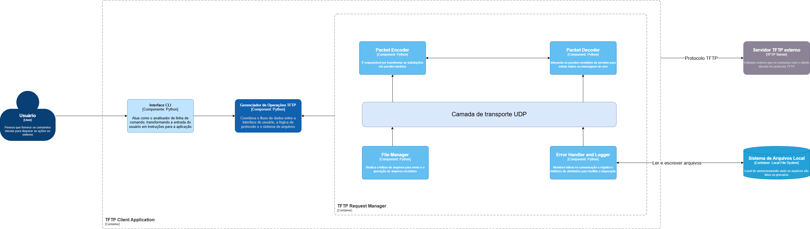
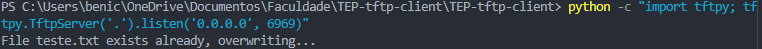
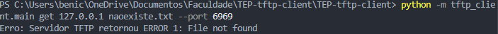

# Cliente TFTP

Cliente TFTP em Python, organizado por módulos, com interface CLI e fluxo real do protocolo TFTP (RFC 1350).

## Objetivo

Este projeto implementa o lado cliente de uma arquitetura cliente-servidor 2-tier, com foco em:

- leitura de comandos pela linha de comando;
- download de arquivos do servidor TFTP;
- upload de arquivos para o servidor TFTP;
- tratamento de pacotes TFTP;
- comunicação via UDP;
- organização para uso de Git pull requests.

## Protocolo estudado

- [TFTP na Wikipedia](https://en.wikipedia.org/wiki/Trivial_File_Transfer_Protocol)
- [RFC 1350](https://datatracker.ietf.org/doc/html/rfc1350)

## Fluxo do protocolo

### Download (RRQ)

1. Cliente envia `RRQ`.
2. Servidor responde com `DATA`.
3. Cliente envia `ACK` do bloco recebido.
4. O processo se repete até chegar ao último bloco, menor que 512 bytes.

### Upload (WRQ)

1. Cliente envia `WRQ`.
2. Servidor responde com `ACK 0`.
3. Cliente envia `DATA` em blocos de até 512 bytes.
4. Cliente aguarda o `ACK` de cada bloco até finalizar.

## Diagrama de Componentes C4



## Organização do projeto

```
├── README.md
├── pyproject.toml
├── .gitignore
├── src/
│   └── tftp_client/
│       ├── __init__.py
│       ├── main.py
│       ├── cli.py
│       ├── client.py
│       ├── protocol.py
│       ├── transport.py
│       ├── files.py
│       └── errors.py
├── tests/
│   ├── __init__.py
│   ├── test_protocol.py
│   ├── test_client.py
│   ├── test_transport.py
│   ├── test_files.py
│   └── test_cli.py
└── docs/
    └── c4-client-diagram.png
```

## Instalação

Clone o repositório e instale o pacote em modo editável:

```bash
git clone <url-do-repositorio>
cd TEP-tftp-client
pip install -e .
```

## Como executar

```bash
python -m tftp_client.main --help
```

Opções disponíveis:

```
usage: tftp-client [-h] [--port PORT] [--timeout TIMEOUT] [--retries RETRIES]
                   [--remote-name REMOTE_NAME]
                   {get,put} host filename

positional arguments:
  {get,put}             Operação TFTP (get = download, put = upload)
  host                  IP ou hostname do servidor TFTP
  filename              Nome do arquivo local ou remoto

options:
  --port PORT           Porta do servidor TFTP (padrão: 69)
  --timeout TIMEOUT     Tempo limite em segundos (padrão: 5.0)
  --retries RETRIES     Quantidade de novas tentativas (padrão: 3)
  --remote-name NAME    Nome remoto do arquivo no servidor
```

## Exemplos de uso

Download de um arquivo do servidor:

```bash
python -m tftp_client.main get 192.168.0.10 arquivo.txt --port 69 --remote-name arquivo.txt
```

Upload de um arquivo para o servidor:

```bash
python -m tftp_client.main put 192.168.0.10 arquivo.txt
```

Upload com nome remoto diferente do local:

```bash
python -m tftp_client.main put 192.168.0.10 arquivo_local.txt --remote-name arquivo_remoto.txt
```

Com porta e timeout customizados:

```bash
python -m tftp_client.main get 192.168.0.10 arquivo.txt --port 6969 --timeout 10 --retries 5
```

---

## Testes automatizados

O projeto possui uma suíte completa de testes com `pytest`, organizada em cinco arquivos, cada um cobrindo uma camada diferente do sistema. **Todos os testes são unitários e não exigem servidor TFTP real** — usam mocks e fakes para simular a rede.

### Pré-requisitos

```bash
pip install pytest
```

### Executar toda a suíte

```bash
python -m pytest
```

### Executar com saída detalhada

```bash
python -m pytest -v -s
```

### Executar apenas um arquivo

```bash
python -m pytest tests/test_protocol.py
python -m pytest tests/test_transport.py
python -m pytest tests/test_client.py
python -m pytest tests/test_files.py
python -m pytest tests/test_cli.py
```

### Executar um teste específico

```bash
python -m pytest tests/test_client.py::test_download_flow_writes_file
python -m pytest tests/test_client.py::test_client_retries_on_timeout_and_recovers
```

---

### Descrição dos testes por arquivo

#### `tests/test_protocol.py`

Verifica a montagem e o parsing de todos os tipos de pacote TFTP definidos na RFC 1350.

| Teste                                 | O que valida                                                     |
| ------------------------------------- | ---------------------------------------------------------------- |
| `test_build_rrq_starts_with_opcode` | Pacote RRQ começa com opcode `\x00\x01`                       |
| `test_build_wrq_starts_with_opcode` | Pacote WRQ começa com opcode `\x00\x02`                       |
| `test_build_ack`                    | ACK do bloco 3 gera `\x00\x04\x00\x03`                         |
| `test_build_data`                   | DATA do bloco 7 com payload `abc` gera bytes corretos          |
| `test_parse_packet`                 | `parse_packet` extrai opcode e payload corretamente            |
| `test_parse_data`                   | `parse_data` extrai número de bloco e conteúdo               |
| `test_parse_ack`                    | `parse_ack` extrai número de bloco do ACK                     |
| `test_split_request`                | `split_request` separa filename e mode de um RRQ/WRQ           |
| `test_build_error`                  | Pacote ERROR é montado com opcode, código e mensagem +`\x00` |
| `test_parse_error`                  | `parse_error` extrai código e mensagem corretamente           |

#### `tests/test_transport.py`

Verifica o comportamento da camada UDP (`UDPTransport`) usando mocks de socket.

| Teste                                                  | O que valida                                                                    |
| ------------------------------------------------------ | ------------------------------------------------------------------------------- |
| `test_transport_receive_success`                     | Retorna dados e endereço quando o socket responde normalmente                  |
| `test_transport_receive_timeout_raises_custom_error` | `socket.timeout` é convertido em `TransportError("Tempo limite excedido")` |
| `test_transport_receive_oserror_raises_custom_error` | `OSError` é convertido em `TransportError("Falha na comunicação UDP")`   |

#### `tests/test_client.py`

Testa o fluxo completo de download e upload usando `FakeTransport` e `FakeFiles`.

| Teste                                                 | O que valida                                                                  |
| ----------------------------------------------------- | ----------------------------------------------------------------------------- |
| `test_download_flow_writes_file`                    | RRQ é enviado, DATA é recebido, ACK é enviado, arquivo é salvo            |
| `test_upload_flow_sends_data_blocks`                | WRQ é enviado, ACK 0 é aguardado, bloco DATA é enviado, ACK 1 é aguardado |
| `test_download_raises_protocol_error_on_tftp_error` | Pacote ERROR do servidor levanta `ProtocolError` com código e mensagem     |
| `test_client_retries_on_timeout_and_recovers`       | Após 2 falhas de rede, o cliente reenvia e conclui o download com sucesso    |
| `test_client_fails_after_max_retries_exceeded`      | Após esgotar as tentativas (`retries=2`), levanta `TransportError`       |

#### `tests/test_files.py`

Verifica as operações de leitura e escrita do `FileManager`.

| Teste                           | O que valida                                            |
| ------------------------------- | ------------------------------------------------------- |
| `test_read_and_write_bytes`   | Escreve e lê bytes corretamente em arquivo temporário |
| `test_iter_chunks_empty_file` | Arquivo vazio produz um único chunk `b""`            |

#### `tests/test_cli.py`

Testa a interface de linha de comando (`cli.run()`).

| Teste                                        | O que valida                                                                  |
| -------------------------------------------- | ----------------------------------------------------------------------------- |
| `test_cli_get_success`                     | `get` chama `get_file` com argumentos corretos e retorna exit code `0`  |
| `test_cli_put_success`                     | `put` com `--remote-name` chama `put_file` corretamente e retorna `0` |
| `test_cli_handles_client_error_gracefully` | `TFTPClientError` resulta em exit code `1` e mensagem no `stderr`       |

---

### Resultado da execução

```
========================== test session starts ==========================
platform win32 -- Python 3.13.12, pytest-9.0.2, pluggy-1.6.0
rootdir: C:\Users\benic\...\TEP-tftp-client
configfile: pyproject.toml
testpaths: tests
collected 23 items

tests/test_cli.py::test_cli_get_success Download concluído. Bytes recebidos: 27
PASSED
tests/test_cli.py::test_cli_put_success Upload concluído. Resposta recebida: 8 bytes
PASSED
tests/test_cli.py::test_cli_handles_client_error_gracefully PASSED
tests/test_client.py::test_download_flow_writes_file
[REDE -> ENVIO] A enviar para ('127.0.0.1', 69): b'\x00\x01remote.txt\x00octet\x00'
[REDE <- RECEÇÃO] Recebido de ('127.0.0.1', 7000): b'\x00\x03\x00\x01hello'
[REDE -> ENVIO] A enviar para ('127.0.0.1', 7000): b'\x00\x04\x00\x01'
[DISCO] A guardar ficheiro 'local.txt' com os dados: b'hello'
PASSED
tests/test_client.py::test_upload_flow_sends_data_blocks
[REDE -> ENVIO] A enviar para ('127.0.0.1', 69): b'\x00\x02remote.txt\x00octet\x00'
[REDE <- RECEÇÃO] Recebido de ('127.0.0.1', 7000): b'\x00\x04\x00\x00'
[DISCO] A ler o ficheiro 'local.txt' para envio...
[REDE -> ENVIO] A enviar para ('127.0.0.1', 7000): b'\x00\x03\x00\x01hello'
[REDE <- RECEÇÃO] Recebido de ('127.0.0.1', 7000): b'\x00\x04\x00\x01'
PASSED
tests/test_client.py::test_download_raises_protocol_error_on_tftp_error
[REDE -> ENVIO] A enviar para ('127.0.0.1', 69): b'\x00\x01inexistente.txt\x00octet\x00'
[REDE <- RECEÇÃO] Recebido de ('127.0.0.1', 7000): b'\x00\x05\x00\x01File not found\x00'
PASSED
tests/test_client.py::test_client_retries_on_timeout_and_recovers
[REDE INSTÁVEL -> ENVIO] A tentar enviar: b'\x00\x01arquivo.txt\x00octet\x00'
[REDE INSTÁVEL !!] Falha simulada na rede. O pacote perdeu-se! (Falha 1/2)
[REDE INSTÁVEL -> ENVIO] A tentar enviar: b'\x00\x01arquivo.txt\x00octet\x00'
[REDE INSTÁVEL !!] Falha simulada na rede. O pacote perdeu-se! (Falha 2/2)
[REDE INSTÁVEL -> ENVIO] A tentar enviar: b'\x00\x01arquivo.txt\x00octet\x00'
[REDE INSTÁVEL <- RECEÇÃO] Sucesso! Recebido de ('127.0.0.1', 7000): b'\x00\x03\x00\x01dados recuperados'
[REDE INSTÁVEL -> ENVIO] A tentar enviar: b'\x00\x04\x00\x01'
PASSED
tests/test_client.py::test_client_fails_after_max_retries_exceeded
[REDE INSTÁVEL -> ENVIO] A tentar enviar: b'\x00\x01arquivo.txt\x00octet\x00'
[REDE INSTÁVEL !!] Falha simulada na rede. O pacote perdeu-se! (Falha 1/5)
[REDE INSTÁVEL -> ENVIO] A tentar enviar: b'\x00\x01arquivo.txt\x00octet\x00'
[REDE INSTÁVEL !!] Falha simulada na rede. O pacote perdeu-se! (Falha 2/5)
[REDE INSTÁVEL -> ENVIO] A tentar enviar: b'\x00\x01arquivo.txt\x00octet\x00'
[REDE INSTÁVEL !!] Falha simulada na rede. O pacote perdeu-se! (Falha 3/5)
PASSED
tests/test_files.py::test_read_and_write_bytes PASSED
tests/test_files.py::test_iter_chunks_empty_file PASSED
tests/test_protocol.py::test_build_rrq_starts_with_opcode PASSED
tests/test_protocol.py::test_build_wrq_starts_with_opcode PASSED
tests/test_protocol.py::test_build_ack PASSED
tests/test_protocol.py::test_build_data PASSED
tests/test_protocol.py::test_parse_packet PASSED
tests/test_protocol.py::test_parse_data PASSED
tests/test_protocol.py::test_parse_ack PASSED
tests/test_protocol.py::test_split_request PASSED
tests/test_protocol.py::test_build_error PASSED
tests/test_protocol.py::test_parse_error PASSED
tests/test_transport.py::test_transport_receive_success PASSED
tests/test_transport.py::test_transport_receive_timeout_raises_custom_error PASSED
tests/test_transport.py::test_transport_receive_oserror_raises_custom_error PASSED

========================== 23 passed in 0.17s ===========================
```

---

## Teste com servidor externo (integração real)

Os testes automatizados não usam rede real. Para validar o cliente contra um servidor TFTP, utilizamos o `tftpy`.

### Pré-requisitos

```bash
pip install tftpy
```

### Subir o servidor localmente

No **Terminal 1**, dentro da pasta do projeto:

```bash
python -c "import tftpy; tftpy.TftpServer('.').listen('0.0.0.0', 6969)"
```

O servidor fica bloqueado aguardando conexões. Deixe-o rodando.

### Testar download

No **Terminal 2**:

```bash
echo "conteudo de teste" > teste.txt
python -m tftp_client.main get 127.0.0.1 teste.txt --port 6969
```

Saída esperada:

```
Download concluído. Bytes recebidos: 40
```

### Testar upload

```bash
python -m tftp_client.main put 127.0.0.1 teste.txt --port 6969
```

Saída esperada no cliente:

```
Upload concluído. Resposta recebida: 8 bytes
```

Saída esperada no servidor:

```
File teste.txt exists already, overwriting...
```

### Testar erro — arquivo inexistente

```bash
python -m tftp_client.main get 127.0.0.1 naoexiste.txt --port 6969
```

Saída esperada:

```
Erro: Servidor TFTP retornou ERROR 1: File not found
```

### Resultados obtidos

**Upload concluído — cliente:**


**Servidor recebendo o upload:**



**Erro — arquivo inexistente:**


